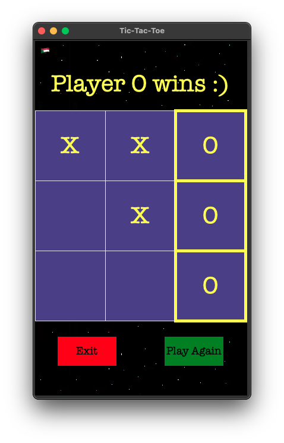

# Tic-Tac-Toe Game

Welcome to the Tic-Tac-Toe game implemented using Python and Tkinter. This project allows you to play a classic Tic-Tac-Toe game in one-player mode (against the computer) or two-player mode.


## Author

**Hiba Eltayeb**  
Email: [hebaaltayeb2@icloud.com](mailto:hebaaltayeb2@icloud.com)

## Features

- **One-player mode**: Play against the computer.
- **Two-player mode**: Play against another person.
- **Simple and intuitive UI**: Easy to navigate and play.
- **Game restart and exit options**: Available after each game.

## Installation

To run this project, you need to have Python installed on your machine. Follow the steps below to set up the project:

1. Clone the repository:

    ```
    git clone <repository_url>
    cd tic-tac-toe
    ```

2. Install the dependencies:

    ```
    pip install -r requirements.txt
    ```

## Usage

To start the game, run the following command:

```
python3 tic-tac-toe.py
```

## Game Screenshots


## Contributions
Contributions are welcome! Please feel free to submit a pull request or open an issue for any improvements or bug fixes.

## Dependencies

- Python 3.x
- Tkinter (usually included with Python)

## License

This project is available under the [MIT License](LICENSE).

